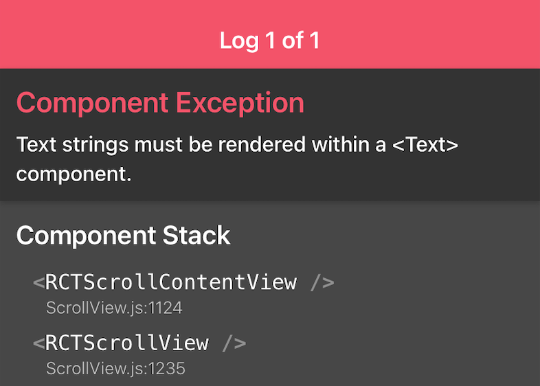
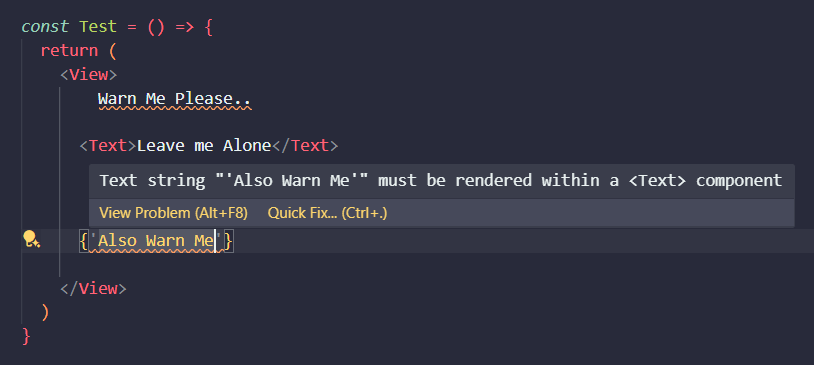

# React Native Text Watcher

Welcome to the **React Native Text Watcher** extension! This extension helps you catch a common mistake in React Native development by providing warnings when text strings are not wrapped within a `<Text>` component.

 

  

## Features

- 📐 **Accurate JSX Parsing**: Precisely identifies JSX portions in your code.
- ⚠️ **Text Wrapping Warnings**: Get warnings when you don't wrap text strings within a `<Text>` component.
- 🔍 **Smart Detection**: Warns you in most cases except for function calls that return strings or string variables.

|                       Problem                       | Prevention to the Problem |
| :-------------------------------------------------: | :-----------------------: |
|  |       |

## Requirements

- A project with `react-native` in `package.json` dependencies.
- The extension activates only for `.tsx` and `.jsx` files.

## Extension Settings

This extension contributes the following settings:

- `reactNativeTextWatcher.enable`: Enable/disable this extension.
- `reactNativeTextWatcher.severity`: Set the severity of the warnings (default: `Warning`).

## Known Issues

- Does not currently warn for function calls that return strings or string variables.

## Release Notes

### 1.0.0

- Initial release of React Native Text Watcher.

### 1.1.0

- Improved JSX parsing accuracy.
- Enhanced warning messages.

## Future Plans

- 🚀 **Function Call Detection**: Introduce the ability to warn on function calls that return strings or string variables.
- 💡 **Component Type Detection**: Rely on the type of the component to avoid warnings for custom text components.

## Personal Note

I am fairly new to React Native. I somehow managed to build a music app using React Native for my final year project. During that period, I often encountered this error: "Text strings must be rendered within a `<Text>` component."

It wasn't a serious error, but it was definitely annoying when I forgot to wrap a text with the `<Text>` component. That error screen with the red header was a constant source of frustration.

So, I came up with this small VS Code extension, **React Native Text Watcher**. It's not complete but offers a good enough solution to give you warnings in obvious cases.

I'm open to collaboration! If you have any ideas or improvements, feel free to contribute.

**Enjoy!** 🎉
